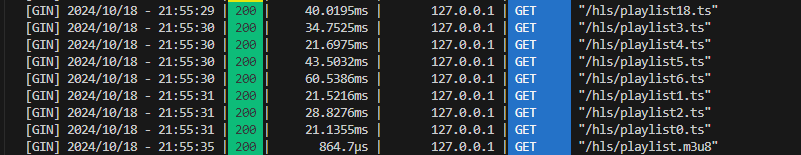

# go-playgrounds

Go言語の実装サンプル集

# Examples

## graphql(auth)

### 概要

Go言語でGraphQLを試す。APIの認証認可はディレクティブという機能を使って実現する。


#### 使用したライブラリ

- [99designs/gqlgen: go generate based graphql server library](https://github.com/99designs/gqlgen)

### usage

```
cd graphql-auth
make go-run
```

### 所感

ライブラリを使用することで開発者はクエリの定義に集中でき、GraphQLの細かな仕様を気にする必要がない。APIにおける認証認可もディレクティブを用いることで比較的容易に導入できる。


## handlebars

[handlebars/readme.md](./handlebars/readme.md)

## hls-server

### 事前準備

ffmpegをインストールしてPathを通しておく。

### usage

```
cd hls-server
make go-run
```

#### HLS配信の動画を試す

配信用の動画ファイルを用意する。適当なmp4動画をアップロードするとサーバー側で変換され、配信可能になる。

1. ブラウザで `localhost:8080` を開く。
2. ファイルを選択して `Upload` ボタンを押す。

アップロード後、hlsフォルダーにm3u8ファイルと各セグメントファイルが生成される。ページを再読み込みすることで動画を再生できる。

再生中にセグメントファ



### 所感

`ffmpeg`やHLSライブラリを使うことで、簡単に動画配信機能を実装できた。動画配信サービス開発の参考になった。

## line-authorization(LINE認証)

### 事前準備


LINE Developerでアカウントを作成し、プロバイダーとチャネルを準備する。

- [LINE Developers](https://developers.line.biz/ja/)

### usage

```
cd line-authorization
make go-run
```

1. ブラウザで `localhost:8009` を開く。
2. LINEログインボタンを押し、 **LINE Developers** のアカウントでログインする

開発中のチャネルでは任意のLINEユーザーでログインできないが、認証に成功するとcallbackページが表示される。

### 所感

クライアントIDやチャネルID、アクセストークンといった複数の用語があり、初めての時は混乱するが、APIドキュメントをしっかり読むことで理解できた。Postmanを使ってアクセストークンの取得とメッセージ送信の検証もできた。今後、LINEログイン機能をサービスに活用したい。


## minio

オブジェクトストレージを試す。AWSにリソースを作って試すのは少し億劫であったため、OSSを使う。公式のDockerイメージがあるので、それを使う。

[MinIO Object Storage for Container — MinIO Object Storage for Container](https://min.io/docs/minio/container/index.html)

### 事前準備

Podmanを使う。Dockerを使う場合は公式のチュートリアルを見て実行する。

### usage

```
mkdir -p ~/minio/data

podman run \
   -p 9000:9000 \
   -p 9001:9001 \
   -e "MINIO_ROOT_USER=ROOTNAME" \
   -e "MINIO_ROOT_PASSWORD=CHANGEME123" \
   quay.io/minio/minio server /data --console-address ":9001"
```

1. `localhost:9000`にブラウザでアクセスし、ログインする
2. `test`の名前でBucketを作成する
3. アクセスキーを作成し、`.env`に記述する

エンドポイントは `localhost:9000`

### 所感

オブジェクトストレージを手軽に試すには非常に良い。AWSのS3互換があるため、コードをそのまま流用できる点も便利だ。サービス開発前の試行段階で活用したい。


## totp （Time-based One-Time Password）

セキュリティ強化のため、二要素認証を組み込みたいと考え、アルゴリズムやその仕組を調べて実装。


*以下ChatGPTによる自動生成。時間が空いたときに整える。

---

### 概要

TOTP（時刻ベースのワンタイムパスワード）は、RFC 6238で定義されたアルゴリズムであり、一定の時間ごとに一度だけ使用できるパスワードを生成する技術である。この技術はHMACベースのワンタイムパスワード（HOTP）に基づき、ユーザーのシークレットキーと現在のタイムスタンプを使用してパスワードを生成する。生成されたパスワードは通常30秒程度で無効になるため、セキュリティを強化する手段として用いられる。

### 実装概要


TOTPは次の流れで動作する:

1. 初回認証時にシークレットキーを生成し、共有する（QRコードなどで配布）。
2. 各クライアントはシークレットキーと現在の時間をもとにTOTPコードを生成する。
3. サーバー側でもシークレットキーとサーバー時間に基づいてTOTPコードを生成し、クライアントが送信したコードと一致するかを検証する。

#### 利用ケース

TOTPは多要素認証（MFA）で広く使用されている。パスワード入力後、追加でTOTPコードを要求することで、アカウントへの不正アクセスを防ぐ。オンラインバンキング、クラウドサービス、VPN、一般的なWebサービスなどで利用されている。

---

### 使い方

```
cd onetime-password
make go-run
```

### 所感

TOTPの実装は意外と簡単だった。二要素認証をサービスに手軽に組み込むことができるため、システム管理者向けのページに導入したい。
